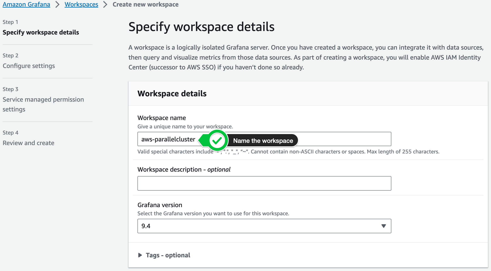
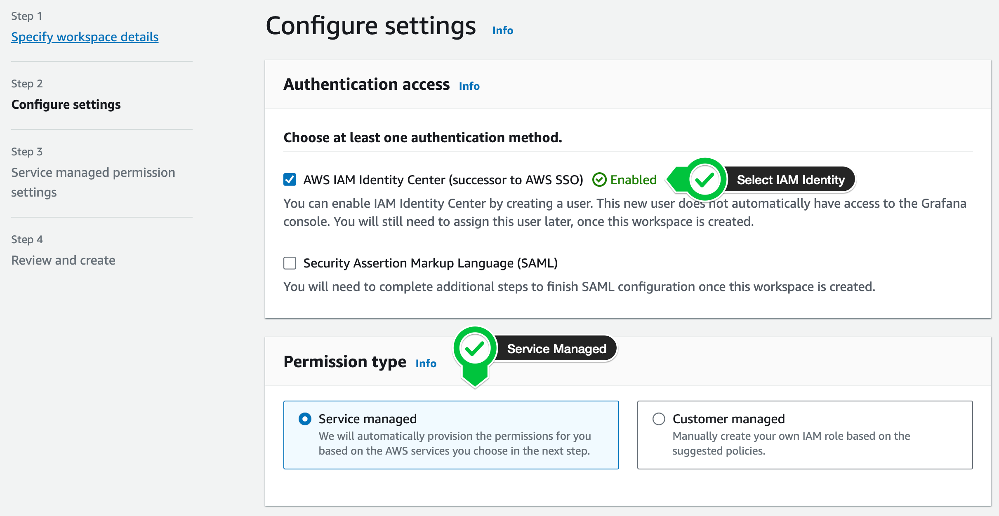
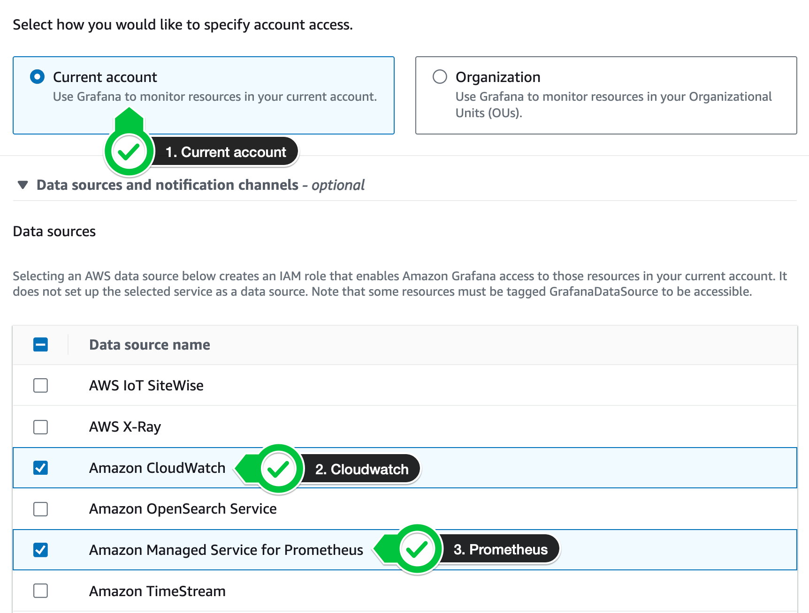
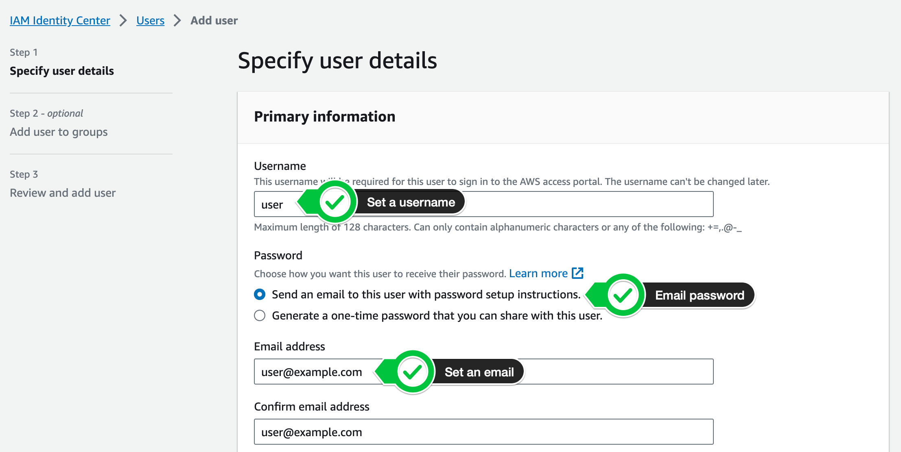
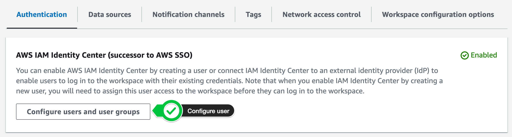
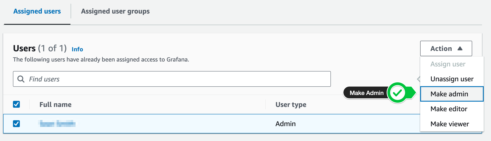

# Grafana

In this section we'll setup [Amazon Managed Grafana](https://aws.amazon.com/grafana/), this is a hosted version of Grafana that will plot metrics collected from Prometheus and Cloudwatch.

## Grafana Setup

1. First navigate to the [Grafana Console](https://us-east-1.console.aws.amazon.com/grafana/home?region=us-east-1) > click **Create**.

2. Next give it a name like *gpu-monitoring*



3. On the next screen select the following options:

* Select **IAM Identity Center** as the authentication access
* Select **Service Managed** as the *Permission Type*
* Leave the rest of the options as the their default



4. Enable the following two data sources

* Select **Amazon Managed Service for Prometheus**
* Select **Amazon CloudWatch** 



5. On the next screen click **Create Workspace**

Congrats! you just created a managed Grafana Workspace.

## User Setup

In this section we'll setup a user in *IAM Identity Center* so we can login to Grafana.

1. Navigate to [IAM Identity Center](https://us-east-1.console.aws.amazon.com/singlesignon/home?region=us-east-1#) > **Enable**

2. Click on **Users** > **Add user**

3. Give the user a username and email:

    * Set a username
    * Select **Send Email** as the password mechanism
    * Set an email address
    * Set a First and Last Name

    

4. Skip adding the user to a group

5. Review and create the user

6. Check your email for a temporary password

## Make Admin

1. Next go back to [Grafana Console](https://us-east-1.console.aws.amazon.com/grafana/home?region=us-east-1) > **gpu-monitoring** workspace

2. Under **Authentication** > **Configure users and Groups**



3. Select the user you just created and make them admin



## Setup Prometheus

1. Create a prometheus workspace using the *AWS CLI*

```bash
export GRAFANA_WORKSPACE=gpu-monitoring
export AWS_DEFAULT_REGION=us-east-1
WORKSPACE_ID=$(sudo aws amp create-workspace --region $AWS_DEFAULT_REGION --alias $GRAFANA_WORKSPACE --query workspaceId)
echo $WORKSPACE_ID
```
