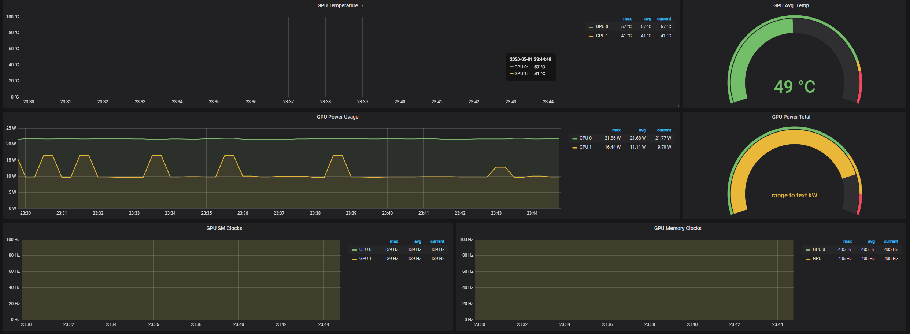

# DCGM Metrics



[DCGM Exporter]() is a tool that exports gpu metrics to prometheus,

```bash
docker run -d --gpus all --rm -p 9400:9400 nvcr.io/nvidia/k8s/dcgm-exporter:3.2.5-3.1.8-ubuntu20.04
```
